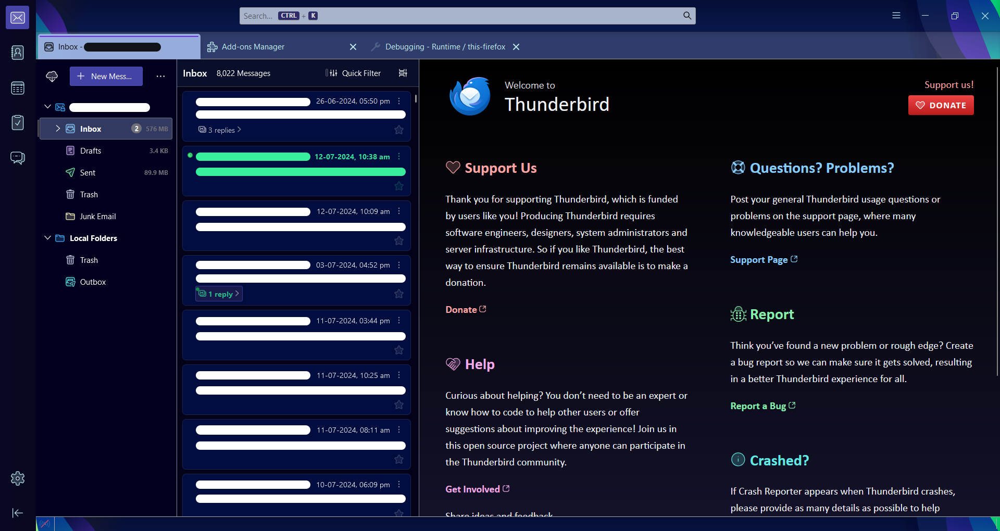

# Arctic Night
Yet another theme for Mozilla Thunderbird, christened Arctic Night

This theme is inspired by Mozilla's own amazing [Firefox Alpenglow](https://addons.mozilla.org/en-US/firefox/addon/firefox-alpenglow/) theme. 

> [!WARNING]
> This theme is a work in progress, this might cause some unforeseen results of hindrance in visibility of some elements.

## Usage

 1. Get the latest theme `.xpi` file from the [releases](https://github.com/Pratham-T/arcticnight-thunderbird/releases/latest/) page.
 2. Open Thunderbird, go to `Settings > Add-ons and Themes`
 3. Click on the gear icon at the top-right corner and then select `Install Add-on From File...`
 4. Select the `arcticnight.xpi` file.
 5. Enjoy!

## Known quirks

 - In new mail composition window, the font color of inactive fields (To, Cc, Bcc, Subject) gets set to `#c0eef0`, which has bad visibility with the field background color `#a8b4cb`. Thuderbird certainly picks this from one of my theme configuration, however I am yet to find the css variable or property affecting this color directly.
 - Theming the message display body and message compose window directly is not possible via static themes. This reqires dynamic themes. See [here](https://developer.thunderbird.net/add-ons/web-extension-themes#theming-message-compose-windows-and-message-display-tabs). This is currently a low priority future to-do.
 - Settings is not themed.

> [!NOTE]
> The current testing in Chat, Calendar and Tasks page is very limited due to me not using those currently (still waiting for Exchange calendar support ;-;). There may be more such quirks or inconsistencies there.

## Planned TO-DO

 - [ ] Standardize the colors used in the shape of a color palette in the stylesheet.
 - [ ] Release on Thunderbird webstore.
 - [ ] Theming of settings menu (Explore if that is even possible in the first place!)
 - [ ] Light theme
 - [ ] Both light and dark theming based on system theme
 - [ ] Dynamic theme with message body and message compose window themed as well.

## Contributing

Feel free to fork and send a PR for any change you might seem suitable. Accepting drastic changes will be based on my subjective decision :p

If you face any theming inconsistencies or feel the palette can be improved at any place, you can open a new Issue. Make sure to check already open issues for any similar discussion.

Discussions are also open for any theme suggestions!